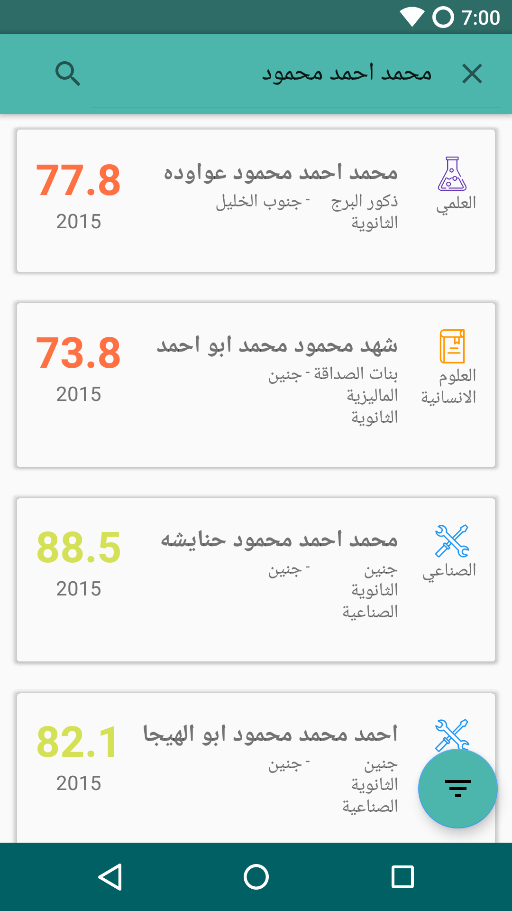
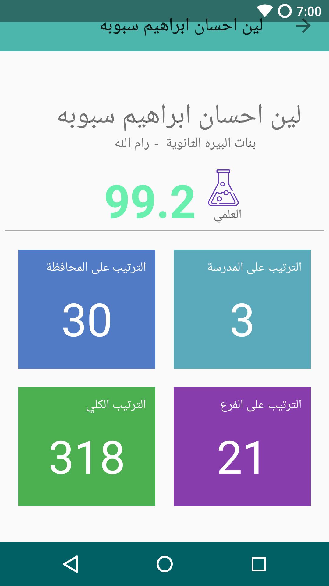
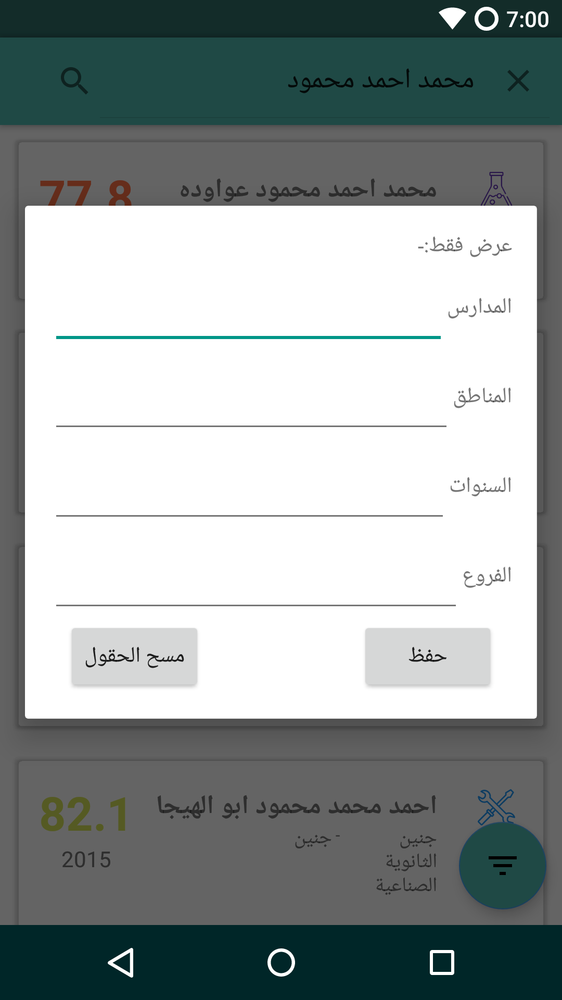
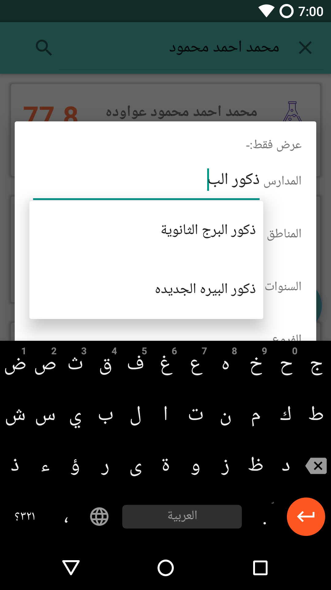
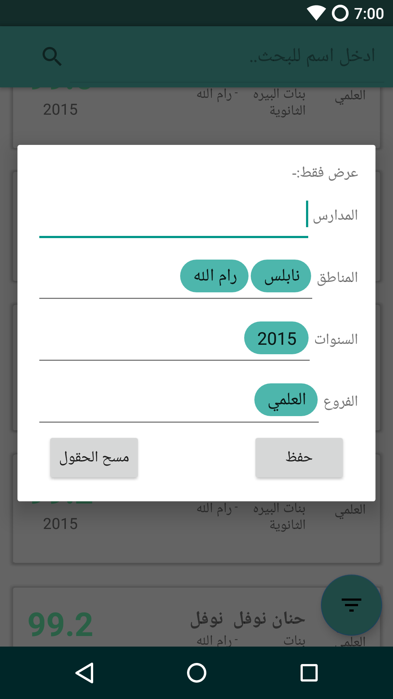

# Palestinian Tawjihi Android Application
The app utilizes my other project, [Tawjihi-backend-server](https://github.com/ghaith96/Tawjihi-backend-server)
to facilate the access to Tawjihi grades.

It also presents some helpful statistical information that is
not easily computable otherwise.

Libraries used to realize the application:

 1. [Google's GSON](https://github.com/google/gson): 
    Used to parse the JSON server response.

 2. [Nachos](https://github.com/hootsuite/nachos): 
    Provides the chips in the Filter Menu.
    Plus it provides Autocomplete feature.

 3. [ButterKnife](https://github.com/JakeWharton/butterknife): 
    Field and method binding for Android views.
    It uses annotation processing to generate boilerplate code for you.

 4. [Shimmer Effect](https://github.com/facebook/shimmer-android): 
    Shimmer Effect for when waiting for the results.
 
---
# Screenshots

  ## Different Student Cards  
  

  ## Stats Fragment
  

  ## Filter Window
  

  ### Autocomplete
  

  ### With Filters
  

## TODO:
* <b>Refactoring</b> the code and  <b>modulating</b> the code (by implementing MVP architecture).
* Better UI/UX (by implementing Google's Material guidelines).
* Rewrite the app using [Flutter](https://www.flutter.io/),
    to provide easy access on the two major mobile platforms, IOS and Android.
